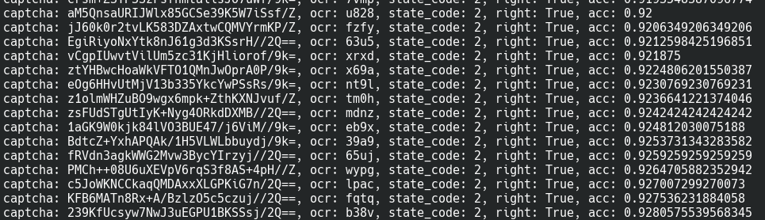
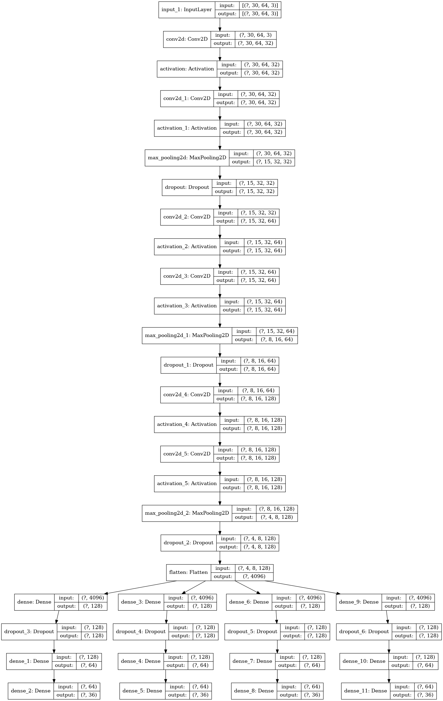

# 🕷️ncee-spider

江西地区高考批量查分/查录取工具


## Usage

### main.py

成绩/录取查询工具

```
usage: main.py [-h] [-f SRC_FILE] [-o OUTPUT_FILE] [-t OUTPUT_CONTENT_TYPE] [-s QUERY_ORDER] [-c CONFIG_FILE] [-m MODEL_FILE] {i,e,s,f}

Program to get NCEE score.

positional arguments:
  {i,e,s,f}             sub_command. 
                        i: import student info
                        e: export score data
                        s: print statistic info
                        f: fetch student score from website

optional arguments:
  -h, --help            show this help message and exit
  -f SRC_FILE           student info from excel file
  -o OUTPUT_FILE        output excel file
  -t OUTPUT_CONTENT_TYPE
                        output content type. 0: 总分，1: 小分，2：录取. default: 0
  -s QUERY_ORDER        order to query student. 0: 随机，1: 顺序，2：倒序. default: 0
  -c CONFIG_FILE        config file path, default is ./configuration.yaml
  -m MODEL_FILE         model file path
```

**notice：**

1. 验证码识别
  - 如果`configuration.yaml`中的`spider`.`use_offline_model`配置为`true`，则使用内置模型进行验证码OCR预测，需要通过`-m`选项指定模型文件（可以使用项目附带的预训练模型文件`model.h5`）
  - 如果配置为`false`，则使用baidu-ocr服务识别验证码，请在[百度AI开放平台](https://ai.baidu.com/ai-doc/OCR/zk3h7xz52)手动注册申请，并在`configuration.yaml`中填入配置信息
    （一般来说，百度ocr服务的识别准确率要远低于自己训练的模型）

2. 该工具使用mongodb作为存储后端，使用默认mongodb配置，自定义需求请修改`db.py`文件
    数据库名为`ncee_spider`，存储的表及其含义如下：
  - `students` 学生信息数据
  - `scores` 存储爬取到的录取页面源文件，用于后期解析并导出成绩
  - `captcha` 在爬取成绩的过程中，会在这里存储识别成功的验证码图像`img`和对应的文字`txt`，这部分数据可以作为数据集用于训练自定义模型

使用流程：

1. `python ./main.py i` 导入学生数据

2. `python ./main.py f` 爬取考生成绩、录取信息存储到数据库

3. `python ./main.py e` 按需求导出特定数据

可以使用`python ./main.py s`实时查看统计信息

### model.py

模型训练程序

```
usage: model.py [-h] [-m MODEL_FILE] [-c CONFIG_FILE] {fetch,train,test}

tool to train model for captcha recognition

positional arguments:
  {fetch,train,test}  sub_command. 
                      fetch: fetch more captcha image from website
                      train: train model using all captcha data in db
                      test: test captcha recognition effect on online data

optional arguments:
  -h, --help          show this help message and exit
  -m MODEL_FILE       model file path
  -c CONFIG_FILE      config file path, default is ./configuration.yaml
```

**仓库中附带的预训练好的模型文件`model.h5`已有较高的识别准确率（93%），一般情况用那个效果就已经很好了。但是如果你愿意，可以用这个工具结合自己获取数据来训练。**

该工具会读取数据库中`captcha`表中存储的验证码作为训练数据集。

使用流程：

1. `python ./main.py fetch` 借助baidu-ocr来扩充数据集
    主要流程是：从网页上获取验证码，然后利用baidu-ocr去尝试识别，这个过程中会使用虚假的学生信息去尝试验证码，因此不需要预先导入学生信息。
    对于验证通过的验证码，会被追加到`captcha`表中，使得数据集得到扩充。

2. `python ./main.py train` 用数据库中的验证码训练模型

3. `python ./main.py test` 用模型去识别网页上的验证码，测试训练好的模型的准确率



模型结构：



